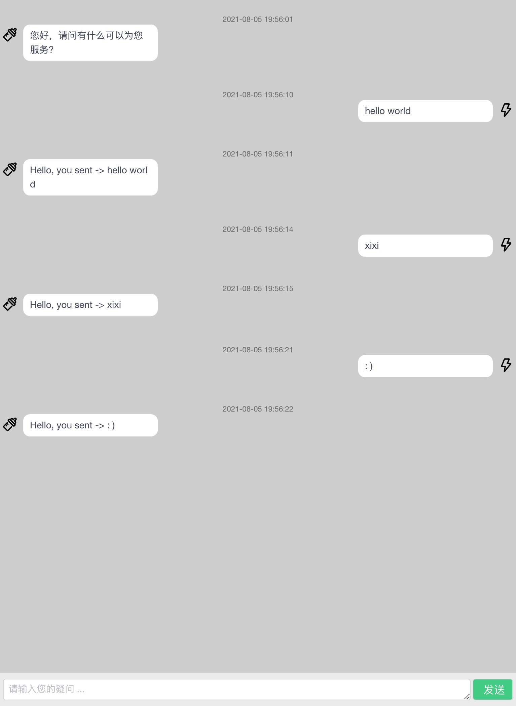

# vue-chat-window with WebSocket

## Introduction

This repo is a chatting window, using vue for frontend and express for backend. The communication between frontend and backend uses **web-socket** technical.




## Main Logic

- Frontend: listen your websocket port using `WebSocket()`

  ```javascript
  mounted() {
      // ws 连接对象
      this.ws = new WebSocket("ws://localhost:8999/message");

      // 建立 ws 连接
      this.ws.onopen = (event) => {
          console.log("Successfully connected to the echo websocket server...", event)
      }

      // 接收消息
      this.ws.onmessage = (event) => {
          this.msg.push({
          date: this.moment().format("YYYY-MM-DD HH:mm:ss"),
          content: event.data,
          self: false,
          });
      }
  },    

  methods: {
      send() {
          // 发送消息
          this.ws.send(this.inputContent);
      },
  }
  ```

- Backend: receive message from frontend. Besides, in order to mocking chatting message flow, backend should return a message immediately. But in this vue project, we use `v-for` to present message HTML element and set the key of the element with message items' date, which means message items' date should not be duplicate, so we send back message after 1 sec receiving message.

    ```javascript
    var express = require('express')
    var http = require('http')
    var WebSocket = require('ws')
    const app = express();
    const server = http.createServer(app);
    const wss = new WebSocket.Server({ server });

    wss.on('connection', (ws) => {
        ws.on('message', (message) => {
            var timeoutId = setTimeout(() => {
                console.log('received: %s', message);
                ws.send(`Hello, you sent -> ${message}`);
            }, 1000);
        });

        ws.send('您好，请问有什么可以为您服务？');
    });

    server.listen(process.env.PORT || 8999, () => {
        console.log(`Server started on port ${server.address().port} :)`);
    });
    ```


## Frontend Project setup

### install modules

```
npm install
```

### run project
```
npm run serve
```

## Backend Project setup
```
node server.js
```


## References

- [WebSocket + Node.js + Express — Step by step tutorial using Typescript](https://medium.com/factory-mind/websocket-node-js-express-step-by-step-using-typescript-725114ad5fe4)

- [vue-chat](https://github.com/microzz/vue-chat)